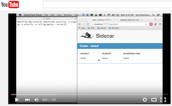
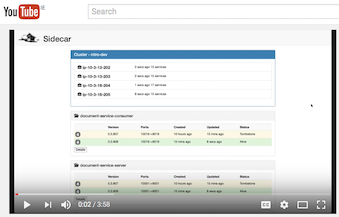

Sidecar 
=====

[](https://travis-ci.org/Nitro/sidecar)
[](https://microbadger.com/images/gonitro/sidecar)
[](https://microbadger.com/images/gonitro/sidecar "Get your own version badge on microbadger.com")

**The main repo for this project is the [Nitro
fork](https://github.com/Nitro/sidecar)**

Sidecar is a dynamic service discovery platform requiring no external
coordination service. It's a peer-to-peer system that uses a gossip protocol
for all communication between hosts. Sidecar health checks local services and
announces them to peer systems. It's Docker-native so your containerized
applications work out of the box. It's designed to be **A**vailable,
**P**artition tolerant, and eventually consistent—where "eventually" is a very
short time window on the matter of a few seconds.

Sidecar is part of a small ecosystem of tools. It can stand entirely alone
or can also leverage:

 * [Lyft's Envoy Proxy](https://github.com/envoyproxy/envoy) - In less than
   a year it is fast becoming a core microservices architecture component.
   Sidecar implements the Envoy proxy SDS, CDS, and LDS APIs (v1). These
   allow a standalone Envoy to be entirely configured by Sidecar. This is
   best used with Nitro's
   [Envoy proxy container](https://hub.docker.com/r/gonitro/envoyproxy/tags/).

 * [haproxy-api](https://github.com/Nitro/haproxy-api) - A separation layer
   that allows Sidecar to drive HAproxy in a separate container. It also
   allows a local HAproxy to be configured against a remote Sidecar instance.

 * [sidecar-executor](https://github.com/Nitro/sidecar-executor) - A Mesos
   executor that integrates with Sidecar, allowing your containers to be
   health checked by Sidecar for both service health and service discovery.
   Also supports a number of extra features including Vault integration for
   secrets management.

 * [Superside](https://github.com/Nitro/superside) - A multi-environment
   console for Sidecar. Has a heads up display, event lists, and graphs
   showing what is happening in one or more Sidecar clusters on a live
   basis.

 * [sidecar-dns](https://github.com/relistan/sidecar-dns) - a working, but
   WIP, project to serve DNS SRV records from Sidecar services state.

 * [Traefik plugin](https://github.com/Nitro/traefik) - A fork of Traefik
   that can be backed by Sidecar. Useful as a gateway from the outside world
   into a Sidecar-based services environment. Working to get this plugin
   pushed upstream.

Overview in Brief
-----------------

Services communicate to each other through a proxy (Envoy or HAproxy) instance
on each host that is itself managed and configured by Sidecar. It is inspired
by Airbnb's SmartStack. But, we believe it has a few advantages over
SmartStack:

 * Eventually consistent model - a better fit for real world microservices
 * Native support for Docker (works without Docker, too!)
 * No dependence on Zookeeper or other centralized services
 * Peer-to-peer, so it works on your laptop or on a large cluster
 * Static binary means it's easy to deploy, and there is no interpreter needed
 * Tiny memory usage (under 20MB) and few execution threads means its very
   light weight

**See it in Action:** We presented Sidecar at Velocity 2015 and recorded a [YouTube
video](https://www.youtube.com/watch?v=VA43yWVUnMA) demonstrating Sidecar with
[Centurion](https://github.com/newrelic/centurion), deploying services in
Docker containers, and seeing Sidecar discover and health check them. The second
video shows the current state of the UI which is improved since the first video.

[](https://www.youtube.com/watch?v=VA43yWVUnMA)
[](https://www.youtube.com/watch?v=5MQujt36hkI)

Complete Overview and Theory
----------------------------


Sidecar is an eventually consistent service discovery platform where hosts learn
about each others' state via a gossip protocol. Hosts exchange messages about
which services they are running and which have gone away. All messages are
timestamped and the latest timestamp always wins. Each host maintains its own
local state and continually merges changes in from others. Messaging is over
UDP except when doing anti-entropy transfers.

There is an anti-entropy mechanism where full state exchanges take place
between peer nodes on an intermittent basis. This allows for any missed
messages to propagate, and helps keep state consistent across the cluster.

Sidecar hosts join a cluster by having a set of cluster seed hosts passed to them
on the command line at startup. Once in a cluster, the first thing a host does
is merge the state directly from another host. This is a big JSON blob that is
delivered over a TCP session directly between the hosts.

Now the host starts continuously polling its own services and reviewing the
services that it has in its own state, sleeping a couple of seconds in between.
It announces its services as UDP gossip messages every couple of seconds, and
also announces tombstone records for any services which have gone away.
Likewise, when a host leaves the cluster, any peers that were notified send
tombstone records for all of its services. These eventually converge and the
latest records should propagate everywhere. If the host rejoins the cluster, it
will announce new state every few seconds so the services will be picked back
up.

There are lifespans assigned to both tombstone and alive records so that:

1. A service that was not correctly tombstoned will go away in short order
2. We do not continually add to the tombstone state we are carrying

Because the gossip mechanism is UDP and a service going away is a higher
priority message, each tombstone is sent twice initially, followed by
once a second for 10 seconds. This delivers reliable messaging of service
death.

Timestamps are all local to the host that sent them. This is because we can
have clock drift on various machines. But if we always look at the origin timestamp
they will at least be comparable to each other by all hosts in the cluster. The
one exception to this is that if clock drift is more than a second or two, the
alive lifespan may be negatively impacted.

Running it
----------

You can download the latest release from the [GitHub
Releases](https://github.com/Nitro/sidecar/releases) page.

If you'd rather build it yourself, you should install the latest version of
the Go compiler. Sidecar has not been tested with gccgo, only the mainstream
Go compiler.

It's a Go application and the dependencies are all vendored into the `vendor/`
directory so you should be able to build it out of the box.

```bash
$ go build
```

Or you can run it like this:

```bash
$ go run *.go --cluster-ip <boostrap_host>
```

You always need to supply at least one IP address or hostname with the
`--cluster-ip` argument. If are running solo, or are the first member, this can
be your own hostname. You may specify the argument multiple times to have
multiple hosts. It is recommended to use more than one when possible.

Note: `--cluster-ip` will overwrite the values passed into the `SIDECAR_SEEDS` environment variable.

### Running in a Container

The easiest way to deploy Sidecar to your Docker fleet is to run it in a
container itself. [Instructions for doing that are provided](docker/README.md).

Nitro Software maintains builds of the [Docker container
image](https://hub.docker.com/r/gonitro/sidecar/) on Docker Hub. Note that
the [README](docker/README.md) describes how to configure this container.


Configuration
-------------

Sidecar configuration is done through environment variables, with a few options
also supported on the command line. Once the configuration has been parsed,
Sidecar will use [Rubberneck](https://github.com/relistan/rubberneck) to print
out the values that were used. The environment variable are as follows.
Defaults are in bold at the end of the line:

 * `SIDECAR_LOGGING_LEVEL`: The logging level to use (debug, info, warn, error)
   **info**
 * `SIDECAR_LOGGING_FORMAT`: Logging format to use (text, json) **text**
 * `SIDECAR_DISCOVERY`: Which discovery backends to use as a csv array
   (static, docker) **`[ docker ]`**
 * `SIDECAR_SEEDS`: csv array of IP addresses used to seed the cluster.
 * `SIDECAR_CLUSTER_NAME`: The name of the Sidecar cluster. Restricts membership
   to hosts with the same cluster name.
 * `SIDECAR_BIND_PORT`: Manually override the Memberlist bind port **7946**
 * `SIDECAR_ADVERTISE_IP`: Manually override the IP address Sidecar uses for
   cluster membership.
 * `SIDECAR_EXCLUDE_IPS`: csv array of IPs to exclude from interface selection
   **`[ 192.168.168.168 ]`**
 * `SIDECAR_STATS_ADDR`: An address to send performance stats to. **none**
 * `SIDECAR_PUSH_PULL_INTERVAL`: How long to wait between anti-entropy syncs.
   **20s**
 * `SIDECAR_GOSSIP_MESSAGES`: How many times to gather messages per round. **15**
 * `SIDECAR_DEFAULT_CHECK_ENDPOINT`: Default endpoint to health check services
   on **`/version`**

 * `SERVICES_NAMER`: Which method to use to extract service names. In both
   cases it will fall back to image name. (`docker_label`, `regex`) **`docker_label`**.
 * `SERVICES_NAME_MATCH`: The regexp to use to extract the service name
   from the container name.
 * `SERVICES_NAME_LABEL`: The Docker label to use to identify service names
   `ServiceName`

 * `DOCKER_URL`: How to connect to Docker if Docker discovery is enabled.
   **`unix:///var/run/docker.sock`**

 * `STATIC_CONFIG_FILE`: The config file to use if static discovery is enabled
   **`static.json`**

 * `LISTENERS_URLS`: If we want to statically configure any event listeners, the
   URLs should go in a csv array here. See **Listeners** section below for more
   on dynamic listeners.

 * `HAPROXY_DISABLE`: Disable management of HAproxy entirely. This is useful if
   you need to run without a proxy or are using something like
   [haproxy-api](https://github.com/Nitro/haproxy-api) to manage HAproxy based
   on Sidecar events. You should also use this setting if you are using
   Envoy as your proxy.
 * `HAPROXY_RELOAD_COMMAND`: The reload command to use for HAproxy **sane defaults**
 * `HAPROXY_VERIFY_COMMAND`: The verify command to use for HAproxy **sane defaults**
 * `HAPROXY_BIND_IP`: The IP that HAproxy should bind to on the host **192.168.168.168**
 * `HAPROXY_TEMPLATE_FILE`: The source template file to use when writing HAproxy
   configs. This is a Go text template. **`views/haproxy.cfg`**
 * `HAPROXY_CONFIG_FILE`: The path where the `haproxy.cfg` file will be written. Note
   that if you change this you will need to update the verify and reload commands.
   **`/etc/haproxy.cfg`**
 * `HAPROXY_PID_FILE`: The path where HAproxy's PID file will be written. Note
   that if you change this you will need to update the verify and reload commands.
   **`/var/run/haproxy.pid`**
 * `HAPROXY_USER`: The Unix user under which HAproxy should run **haproxy**
 * `HAPROXY_GROUP`: The Unix group under which HAproxy should run **haproxy**
 * `HAPROXY_USE_HOSTNAMES`: Should we write hostnames in the HAproxy config instead
   of IP addresses? **`false`**


### Ports

Sidecar requires both TCP and UDP protocols be open on the port configured
via SIDECAR_BIND_PORT (default 7946) through any network filters or firewalls
between it and any peers in the cluster. This is the port that the gossip
protocol (Memberlist) runs on.

## Discovery

Sidecar supports both Docker-based discovery and a discovery mechanism where
you publish services into a JSON file locally, called "static". These can then
be advertised as running services just like they would be from a Docker host.
These are configured with the `SIDECAR_DISCOVERY` environment variable. Using
both would look like:

```bash
export SIDECAR_DISCOVERY=static,docker
```

Zero or more options may be supplied. Note that if nothing is in this section,
Sidecar will only participate in a cluster but will not announce anything.

### Configuring Docker Discovery

Sidecar currently accepts a single option for Docker-based discovery, the URL
to use to connect to Docker. Ideally this will be the same machine that Sidecar
runs on because it makes assumptions about addresses. By default it will use
the standard Docker Unix domain socket. You can change this with the
`DOCKER_URL` env var. This needs to be a url that works with the Docker client.

Note that Sidecar only supports a *single* URL, unlike the Docker CLI tool.

**NOTE**
Sidecar can now use the normal Docker environment variables for configuring
Docker discovery. If you unset `DOCKER_URL` entirely, it will fall back to
trying to use environment variables to configure Docker. It uses the standard
variables like `DOCKER_HOST`, `TLS_VERIFY`, etc.

#### Docker Labels

When running Docker discovery, Sidecar relies on Docker labels to understand
how to handle a service it has discovered. It uses these to:

 1. Understand how to map container ports to proxy ports. `ServicePort_XXX`
 2. How to name the service. `ServiceName=`
 3. How to health check the service. `HealthCheck` and `HealthCheckArgs`
 4. Whether or not the service is a receiver of Sidecar change events. `SidecarListener`
 5. Wether or not Sidecar should entirely ignore this service. `SidecarDiscovery`
 6. HAproxy proxy behavior. `ProxyMode`

**Service Ports**
Services may be started with one or more `ServicePort_xxx` labels that help
Sidecar to understand ports that are mapped dynamically. This controls the port
on which the proxy will listen for the service as well. If I have a service where
the container is built with `EXPOSE 80` and I want my proxy to listen on port
8080 then I will add a Docker label to the service in the form:

```
	ServicePort_80=8080
```

With dynamic port bindings, Docker may then bind that to 32767 but Sidecar will
know which service and port that belongs.

**Health Checks**
If you services are not checkable with the default settings, they need to have
two Docker labels defining how they are to be health checked. To health check a
service on port 9090 on the local system with an `HttpGet` check, for example,
you would use the following labels:

```
	HealthCheck=HttpGet
	HealthCheckArgs=http://:9090/status
```

The currently available check types are `HttpGet`, `External` and
`AlwaysSuccessful`. `External` checks will run the command specified in
the `HealthCheckArgs` label (in the context of a bash shell). An exit
status of 0 is considered healthy and anything else is unhealthy. Nagios
checks work very well with this mode of health checking.

**Excluding From Discovery**
Additionally, it can sometimes be nice to exclude certain containers from
discovery. This is particularly useful if you are running Sidecar in a
container itself. This is accomplished with another Docker label like so:

```
	SidecarDiscover=false
```

**Proxy Behavior**
By default, HAProxy or Envoy will run in HTTP mode. The mode can be changed to TCP by
setting the following Docker label:

```
ProxyMode=tcp
```

**Templating In Labels**
You sometimes need to pass information in the Docker labels which
is not available to you at the time of container creation. One example of this
is the need to identify the actual Docker-bound port when running the health
check. For this reason, Sidecar allows simple templating in the labels. Here's
an example.

If you have a service that is exposing port 8080 and Docker dynamically assigns
it the port 31445 at runtime, your health check for that port will be impossible
to define ahead of time. But with templating we can say:

```--label HealthCheckArgs="http://{{ host }}:{{ tcp 8080 }}/"```

This will then fill the template fields, at call time, with the current
hostname and the actual port that Docker bound to your container's port 8080.
Querying of UDP ports works as you might expect, by calling `{{ udp 53 }}` for
example.

**Note** that the `tcp` and `udp` method calls in the templates refer only
to ports mapped with `ServicePort` labels. You will need to use the port
number that you expect the proxy to use.

### Configuring Static Discovery

Static Discovery requires an entry in the `SIDECAR_DISCOVERY` variable of
`static`. It will then look for a file configured with `STATIC_CONFIG_FILE` to
export services. This file is usually `static.json` in the current working
directory of the process.

A static discovery file might look like this:

```json
[
    {
        "Service": {
            "Name": "some_service",
            "Image": "bb6268ff91dc42a51f51db53846f72102ed9ff3f",
            "Ports": [
                {
                    "Type": "tcp",
                    "Port": 10234,
					"ServicePort": 9999
                }
            ],
			"ProxyMode": "http",
        },
        "Check": {
            "Type": "HttpGet",
            "Args": "http://:10234/"
        }
    },
	{
	...
	}
]
```

Here we've defined both the service itself and the health check to use to
validate its status. It supports a single health check per service.  You should
supply something in place of the value for `Image` that is meaningful to you.
Usually this is a version or git commit string. It will show up in the Sidecar
web UI.

A further example is available in the `fixtures/` directory used by the tests.

Sidecar Events and Listeners
----------------------------

Services which need to know about service discovery change events can subscribe
to Sidecar events. Any time a significant change happens, the listener will
receive an update over HTTP from Sidecar. There are three mechanisms by which
a service can subscribe to Sidecar events:

 1. Add the endpoint in the `LISTENERS_URLS` env var, e.g.:
    ```bash
	export LISTENERS_URLS="http://localhost:7778/api/update"
	```
	This is an array and can be separated with spaces or commas.

 2. Add a Docker label to the subscribing service in the form
    `SidecarListener=10005` where 10005 is a port that is mapped to a
    `ServicePort` with a Docker label like `ServicePort_80=10005`. This port will
    then receive all updates on the `/sidecar/update` endpoint. The subscription
    will be dynamically added and removed when the service starts or stops.

 3. Add the listener export to the `static.json` file exposed by static
    services. The `ListenPort` is a top-level setting for the `Target` and is
	of the form `ListenPort: 10005` inside the `Target` definition.

Monitoring It
-------------

The logging output is pretty good in the normal `info` level. It can be made
quite verbose in `debug` mode, and contains lots of information about what's
going on and what the current state is. The web interface also contains a lot
of runtime information on the cluster and the services. If you are running
HAproxy, it's also recommneded that you expose the HAproxy stats port on 3212
so that Sidecar can find it.

Currently the web interface runs on port 7777 on each machine that runs
`sidecar`.

The `/ui/services` endpoint is a very textual web interface for humans. The
`/api/services.json` endpoint is JSON-encoded. The JSON is still pretty-printed
so it's readable by humans.

Sidecar API
-----------

Other than the UI that lives on the base URL, there is a minimalist API
available for querying Sidecar. It supports the following endpoints:

 * `/services.json`: This returns a big JSON blob sorted and grouped by
   service.
 * `/state.json`: Returns the whole internal state blob in the internal
   representation order (servers -> server -> service -> instances)
 * `/services/<service name>.json`: Returns the same format as the
   `/service.json` endpoint, but only contains data for a single service.
 * `/watch`: Inconsistenly named endpoint that returns JSON blobs on a
   long-poll basis every time the internal state changes. Useful for
   anything that needs to know what the ongoing service status is.

Sidecar can also be configured to post the internal state to HTTP endpoints on
any change event. See the "Sidecar Events and Listeners" section.

Envoy Proxy Support
-------------------

Envoy uses a very different model than HAproxy and thus Sidecar's support for
it is quite different from its support for HAproxy. Envoy makes requests to a
variety of discovery service APIs on a timed basis. Sidecar currently
implements three of these: the Cluster Discovery Service (CDS), the Service
Discovery Service (SDS), and the Listeners Discovery Service (LDS). Nitro
builds and supports [an Envoy
container](https://hub.docker.com/r/gonitro/envoyproxy/tags/) that is tested
and works against Sidecar. This is the easiest way to run Envoy with Sidecar.
You can find an example container configuration
[here](https://gist.github.com/relistan/55a6f54bfc2b79d03eb0c8327c2aeb1c) if
you need to configure it differently from Nitro's recommended setup.

The critical component is that the Envoy proxy needs to be able to talk to
the Sidecar API. By default the Nitro container assumes that Sidecar will
be running on `192.168.168.168:7777`. If your sidecar is addressable on that
address, you can start the envoy container with your platform's equivalent
of the following Docker command:

```bash
docker run -i -t --net host --cap-add NET_ADMIN gonitro/envoyproxy:latest
```

**Note:** This assumes host networking mode so that Envoy can freely open
and close listeners. Beware that the docker (Linux) bridge network is not
reachable on OSX hosts, due to the way containers are run under HyperKit,
so we suggest trying this on Linux instead.


Contributing
------------

Contributions are more than welcome. Bug reports with specific reproduction
steps are great. If you have a code contribution you'd like to make, open a
pull request with suggested code.

Pull requests should:

 * Clearly state their intent in the title
 * Have a description that explains the need for the changes
 * Include tests!
 * Not break the public API

Ping us to let us know you're working on something interesting by opening a
GitHub Issue on the project.

By contributing to this project you agree that you are granting New Relic a
non-exclusive, non-revokable, no-cost license to use the code, algorithms,
patents, and ideas in that code in our products if we so choose. You also agree
the code is provided as-is and you provide no warranties as to its fitness or
correctness for any purpose

Logo
----

The logo is used with kind permission from [Picture
Esk](https://www.flickr.com/photos/22081583@N06/4226337024/).
